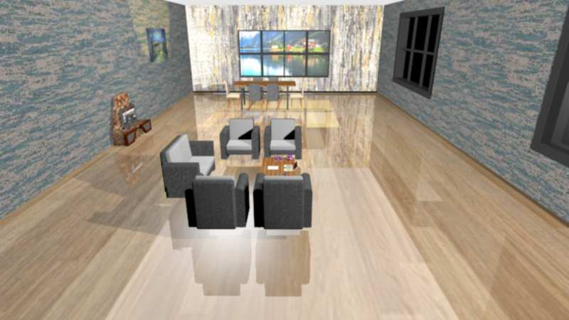
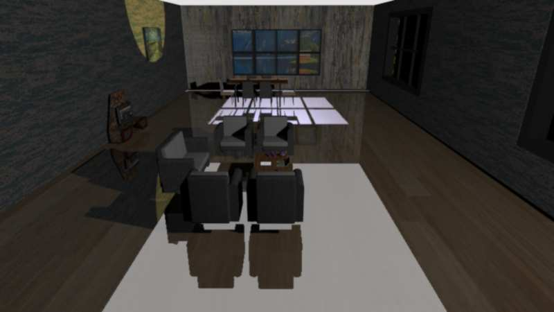
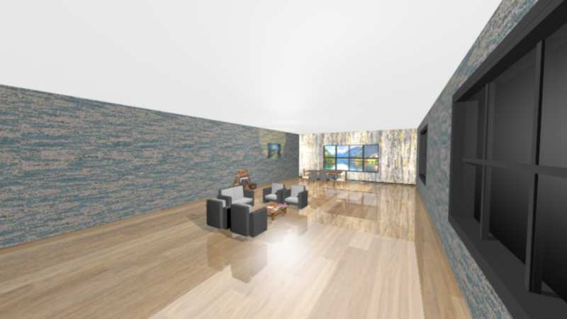
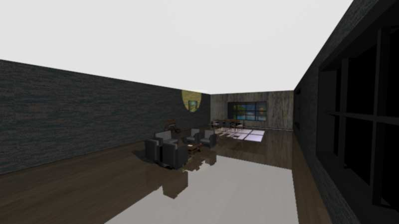
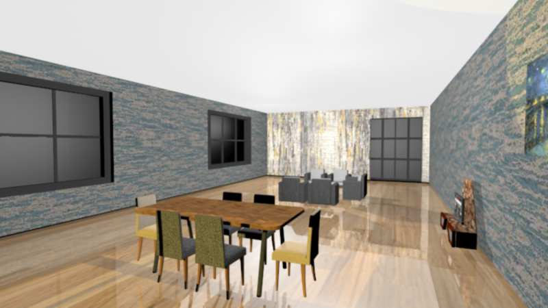
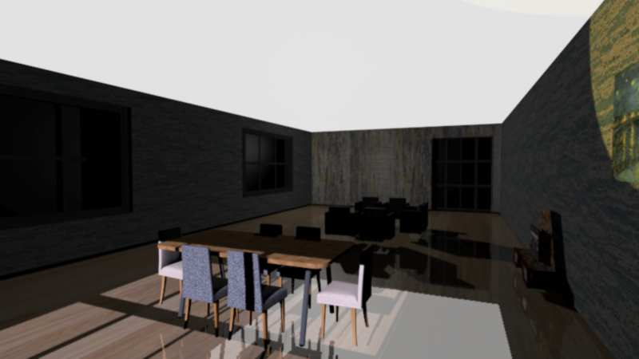
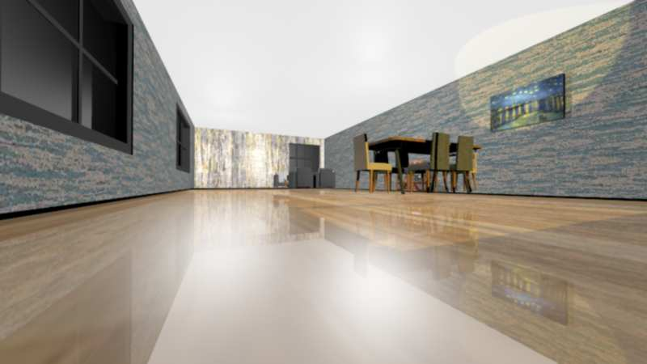
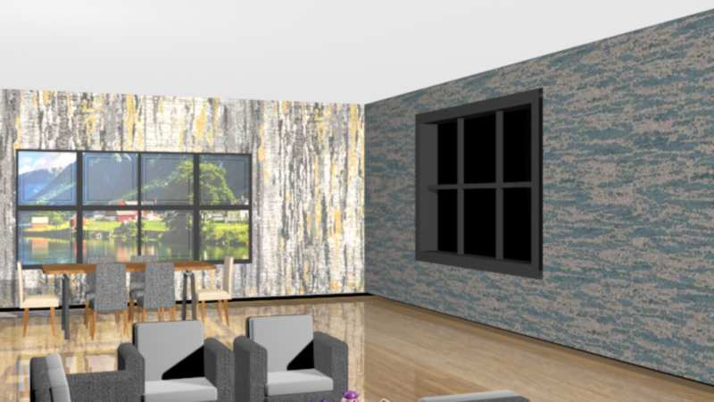

# **Salon Room - 3ds Max Project**  

## **Overview**  
This project showcases a detailed **salon room** designed in **3ds Max**, featuring various lighting conditions and perspectives. The images below highlight different angles of the room, capturing both **daylight** and **nighttime** atmospheres.  

---

## **Day & Night Comparisons**  

### **Main View**  
**Daytime:**  
  
**Nighttime:**  
  

### **Corner View**  
**Daytime:**  
  
**Nighttime:**  
  

### **Alternate Angle**  
**Daytime:**  
  
**Nighttime:**  
  

---

## **Additional Details**  

### **Cozy Corner**  
A closer look at the corner setup, featuring detailed furniture and lighting.  
  

### **Window Perspective**  
A view from the **window**, showcasing how natural light interacts with the interior.  
  

---

## **About the Project**  
This **3D-rendered salon room** was created to explore **lighting, textures, and spatial design** in 3ds Max. The images provide a comparison between different times of the day, emphasizing how light transforms the atmosphere of a room.  

🔹 **Software Used:** 3ds Max  
🔹 **Focus Areas:** Interior design, lighting, rendering  

Let me know if you'd like to add any additional details! 🚀
